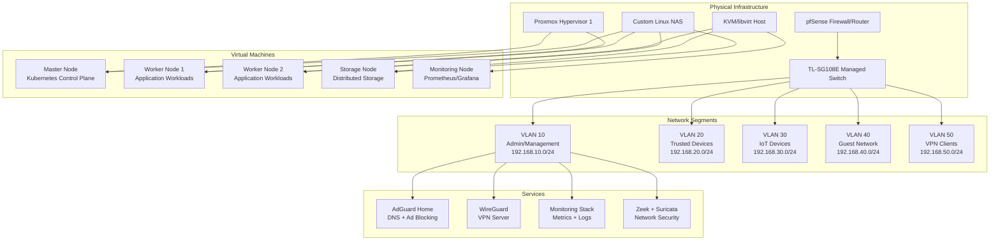
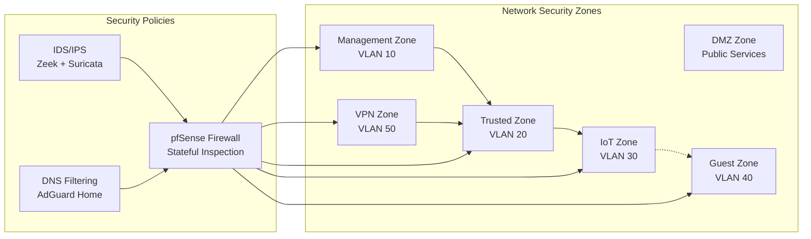
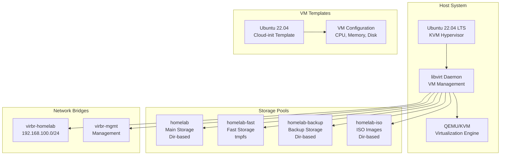
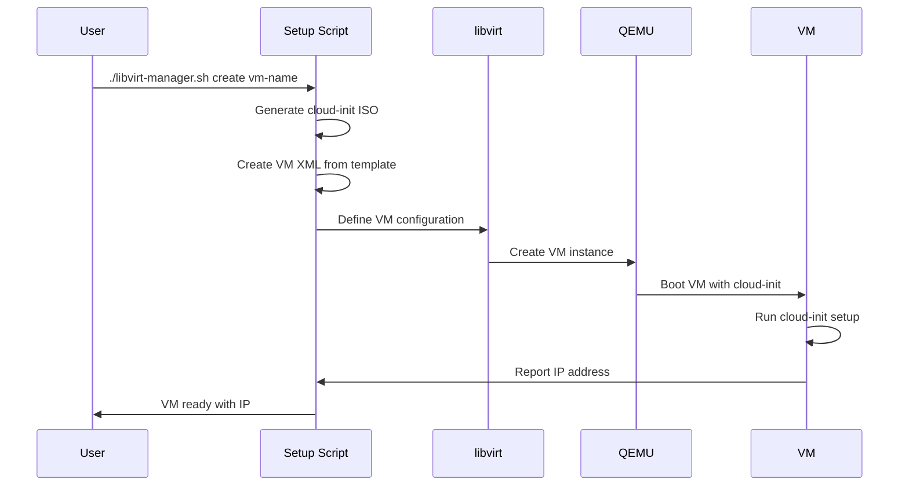
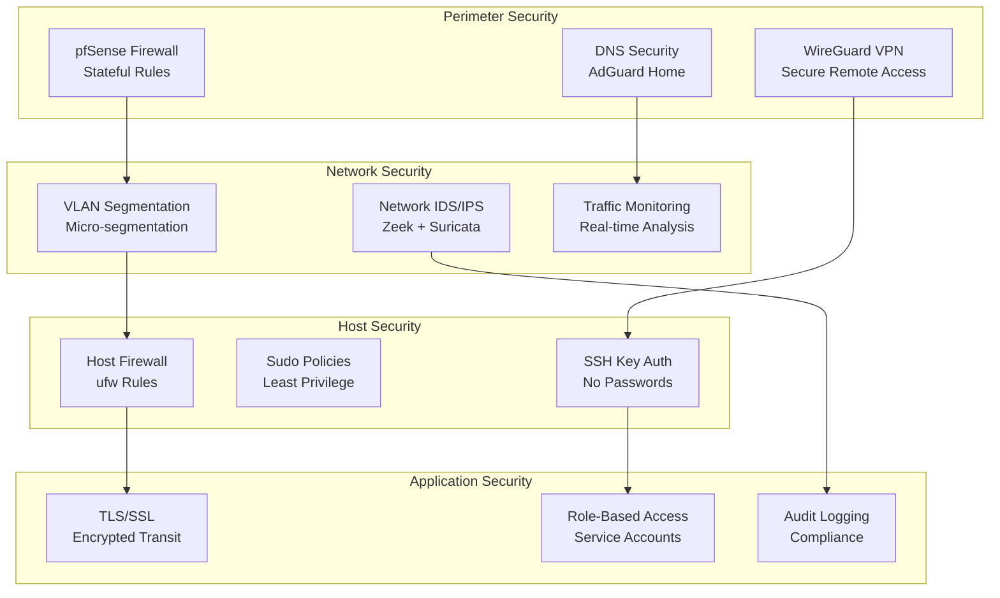
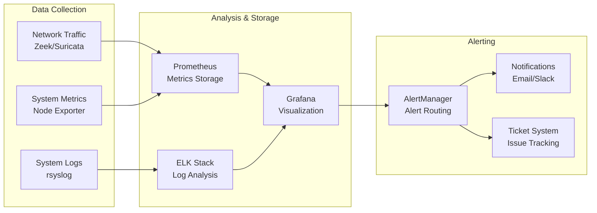
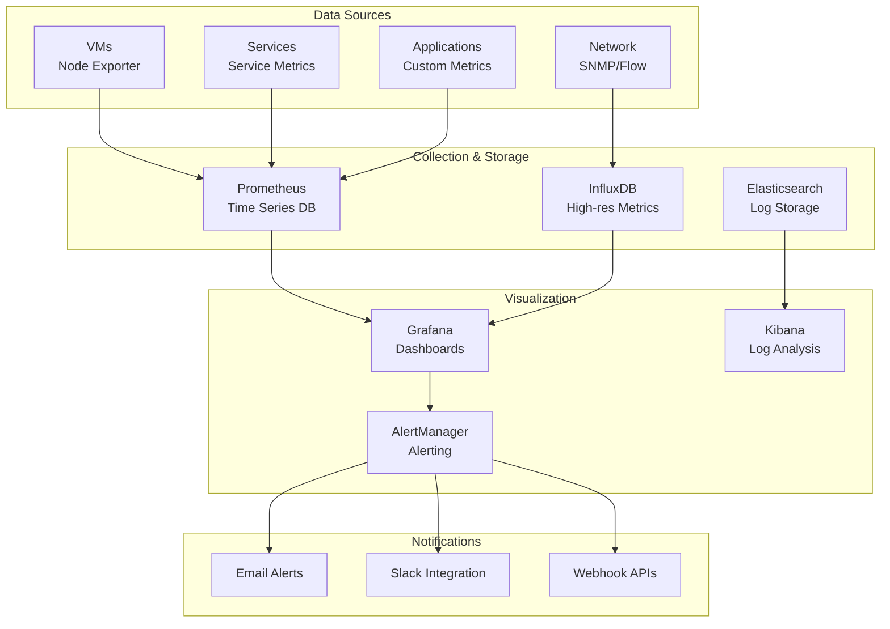
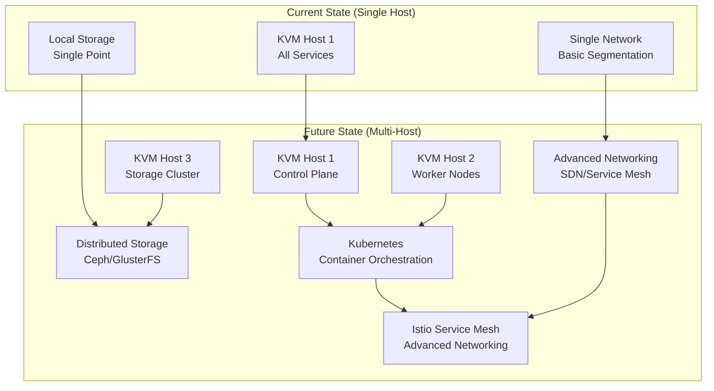

# Homelab Infrastructure Architecture

This document provides a comprehensive overview of the homelab infrastructure architecture, including network topology, system components, security boundaries, and deployment workflows.

## 🏗️ Infrastructure Overview

## 🌐 Network Architecture

### VLAN Segmentation Strategy

### Network Access Control Matrix

| Source VLAN | Target VLAN | Access Level | Services Allowed |
|-------------|-------------|--------------|------------------|
| Admin (10) | All VLANs | Full Access | SSH, HTTPS, SNMP, All |
| Trusted (20) | Admin (10) | Limited | NFS, SMB, HTTPS |
| Trusted (20) | IoT (30) | Restricted | HTTPS, MQTT |
| IoT (30) | Internet | Limited | HTTPS, NTP |
| Guest (40) | Internet | Basic | HTTP, HTTPS |
| VPN (50) | Policy-based | Variable | Per-user policies |

## 🖥️ Virtualization Architecture

### KVM/libvirt Infrastructure

### VM Deployment Workflow

## 🔒 Security Architecture

### Defense-in-Depth Strategy

### Security Monitoring Flow

## 📊 Monitoring & Observability

### Monitoring Stack Architecture

## 🔄 CI/CD & Automation

### Infrastructure Deployment Pipeline

```mermaid
graph LR
    subgraph "Source Control"
        GIT[Git Repository<br/>Infrastructure Code]
        PR[Pull Request<br/>Code Review]
        MERGE[Merge to Main<br/>Approved Changes]
    end
    
    subgraph "CI Pipeline"
        LINT[Linting<br/>shellcheck, yamllint]
        TEST[Testing<br/>Infrastructure Tests]
        SCAN[Security Scan<br/>Vulnerability Check]
    end
    
    subgraph "CD Pipeline"
        PLAN[Terraform Plan<br/>Infrastructure Plan]
        APPLY[Terraform Apply<br/>Resource Creation]
        CONFIG[Ansible Config<br/>Configuration Mgmt]
    end
    
    subgraph "Validation"
        HEALTH[Health Checks<br/>Service Validation]
        MONITOR[Monitoring<br/>Metrics Collection]
        ROLLBACK[Rollback<br/>Failure Recovery]
    end
    
    GIT --> PR
    PR --> MERGE
    MERGE --> LINT
    LINT --> TEST
    TEST --> SCAN
    SCAN --> PLAN
    PLAN --> APPLY
    APPLY --> CONFIG
    CONFIG --> HEALTH
    HEALTH --> MONITOR
    MONITOR --> ROLLBACK
```

## 🚀 Scalability & Growth

### Current vs. Future Architecture

## 📚 Architecture Decisions

### Key Design Principles

1. **Security First**: Every component designed with security as primary concern
2. **Infrastructure as Code**: All configuration version-controlled and automated
3. **Observability**: Comprehensive monitoring and logging throughout
4. **Scalability**: Designed to grow from single-host to multi-host cluster
5. **Learning Focus**: Architecture chosen to demonstrate enterprise practices

### Technology Choices

| Component | Technology | Rationale |
|-----------|------------|-----------|
| Hypervisor | KVM/libvirt | Open source, enterprise-grade, full hardware support |
| Networking | pfSense + VLANs | Professional firewall features, VLAN support |
| Storage | Multiple pools | Different performance tiers for different workloads |
| Monitoring | Prometheus/Grafana | Industry standard, scalable, extensible |
| Security | Zeek + Suricata | Professional network security monitoring |
| Automation | Shell + Python | Reliable, portable, easy to understand |

### Lessons Learned

- **Start Simple**: Begin with basic setup, add complexity gradually
- **Document Everything**: Architecture decisions, configurations, procedures
- **Automate Early**: Manual processes become technical debt quickly
- **Plan for Growth**: Design with scalability in mind from beginning
- **Security Integration**: Build security in, don't bolt it on later

---

*This architecture represents 2+ years of continuous learning and improvement, demonstrating enterprise-level infrastructure practices in a homelab environment.* 🏗️🚀 