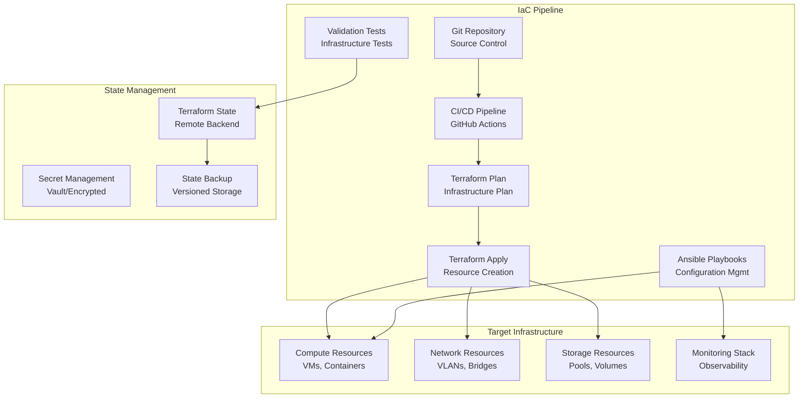

# Infrastructure as Code (IaC)

This directory contains Infrastructure as Code configurations for automated provisioning, configuration management, and deployment of the homelab infrastructure using enterprise-grade tools and practices.

## 🏗️ Architecture Overview



## 📁 Directory Structure

```
iac/
├── terraform/              # Infrastructure provisioning
│   ├── modules/            # Reusable Terraform modules
│   │   ├── vm/             # VM creation module
│   │   ├── network/        # Network configuration module
│   │   └── storage/        # Storage management module
│   ├── environments/       # Environment-specific configurations
│   │   ├── development/    # Dev environment
│   │   ├── staging/        # Staging environment
│   │   └── production/     # Production environment
│   └── providers/          # Provider configurations
├── ansible/                # Configuration management
│   ├── playbooks/          # Ansible playbooks
│   ├── roles/             # Custom Ansible roles
│   ├── inventory/         # Inventory management
│   └── group_vars/        # Group variables
├── kubernetes/            # Container orchestration
│   ├── manifests/         # Kubernetes manifests
│   ├── helm-charts/       # Helm charts
│   └── operators/         # Custom operators
└── scripts/               # Automation scripts
    ├── deploy.sh          # Deployment automation
    ├── validate.sh        # Infrastructure validation
    └── cleanup.sh         # Resource cleanup
```

## 🚀 Technologies Used

### Terraform (Infrastructure Provisioning)
- **Version:** >= 1.5.0
- **Providers:** libvirt, local, random, template
- **State Backend:** Local with planned remote backend
- **Modules:** Custom modules for VM, network, and storage

### Ansible (Configuration Management)
- **Version:** >= 2.14
- **Collections:** community.libvirt, kubernetes.core
- **Inventory:** Dynamic inventory with libvirt
- **Vault:** Encrypted secrets management

### Kubernetes (Container Orchestration)
- **Distribution:** K3s for lightweight deployment
- **Networking:** Flannel CNI
- **Storage:** Local path provisioner
- **Ingress:** Traefik ingress controller

## 🎯 Getting Started

### Prerequisites

```bash
# Install Terraform
curl -fsSL https://apt.releases.hashicorp.com/gpg | sudo apt-key add -
sudo apt-add-repository "deb [arch=amd64] https://apt.releases.hashicorp.com $(lsb_release -cs) main"
sudo apt update && sudo apt install terraform

# Install Ansible
sudo apt update
sudo apt install -y ansible python3-pip
pip3 install ansible-lint

# Install kubectl and helm
curl -LO "https://dl.k8s.io/release/$(curl -L -s https://dl.k8s.io/release/stable.txt)/bin/linux/amd64/kubectl"
sudo install -o root -g root -m 0755 kubectl /usr/local/bin/kubectl
curl https://raw.githubusercontent.com/helm/helm/master/scripts/get-helm-3 | bash

# Verify installations
terraform version
ansible --version
kubectl version --client
helm version
```

### Quick Deployment

```bash
# Clone repository and navigate to IaC directory
cd iac/

# Initialize Terraform
cd terraform/environments/development
terraform init

# Plan infrastructure changes
terraform plan -out=tfplan

# Apply infrastructure changes
terraform apply tfplan

# Configure infrastructure with Ansible
cd ../../../ansible
ansible-playbook -i inventory/homelab.yml playbooks/site.yml

# Deploy Kubernetes cluster
cd ../kubernetes
kubectl apply -k manifests/

# Verify deployment
../scripts/validate.sh
```

## 🏗️ Terraform Modules

### VM Module

```hcl
# terraform/modules/vm/main.tf
terraform {
  required_version = ">= 1.5"
  required_providers {
    libvirt = {
      source  = "dmacvicar/libvirt"
      version = "~> 0.7"
    }
  }
}

resource "libvirt_domain" "vm" {
  name   = var.vm_name
  memory = var.memory
  vcpu   = var.vcpus

  cloudinit = libvirt_cloudinit_disk.commoninit.id

  network_interface {
    network_name   = var.network_name
    wait_for_lease = true
    mac            = var.mac_address
  }

  disk {
    volume_id = libvirt_volume.vm_disk.id
  }

  console {
    type        = "pty"
    target_port = "0"
    target_type = "serial"
  }

  graphics {
    type        = "vnc"
    listen_type = "address"
    autoport    = true
  }
}

resource "libvirt_volume" "vm_disk" {
  name             = "${var.vm_name}-disk.qcow2"
  pool             = var.storage_pool
  size             = var.disk_size
  format           = "qcow2"
  base_volume_name = var.base_image
  base_volume_pool = var.base_pool
}

resource "libvirt_cloudinit_disk" "commoninit" {
  name           = "${var.vm_name}-cloudinit.iso"
  pool           = var.storage_pool
  user_data      = templatefile("${path.module}/templates/cloud-init.tpl", {
    hostname     = var.vm_name
    ssh_keys     = var.ssh_keys
    packages     = var.packages
    runcmd       = var.runcmd
  })
  network_config = templatefile("${path.module}/templates/network.tpl", {
    ip_address = var.ip_address
    gateway    = var.gateway
    nameserver = var.nameserver
  })
}
```

### Network Module

```hcl
# terraform/modules/network/main.tf
resource "libvirt_network" "homelab_network" {
  name      = var.network_name
  mode      = "nat"
  addresses = [var.network_cidr]
  
  dns {
    enabled = true
    forwarders {
      address = "8.8.8.8"
    }
    forwarders {
      address = "1.1.1.1"
    }
  }

  dhcp {
    enabled = var.dhcp_enabled
  }

  dynamic "dhcp" {
    for_each = var.dhcp_enabled ? [1] : []
    content {
      enabled = true
      dynamic "host" {
        for_each = var.static_hosts
        content {
          hostname = host.value.hostname
          ip       = host.value.ip
          mac      = host.value.mac
        }
      }
    }
  }
}
```

### Storage Module

```hcl
# terraform/modules/storage/main.tf
resource "libvirt_pool" "storage_pool" {
  name = var.pool_name
  type = var.pool_type
  path = var.pool_path
}

resource "libvirt_volume" "base_images" {
  for_each = var.base_images
  
  name   = each.key
  pool   = libvirt_pool.storage_pool.name
  source = each.value.source
  format = each.value.format
}

resource "libvirt_volume" "vm_volumes" {
  for_each = var.vm_volumes
  
  name             = each.key
  pool             = libvirt_pool.storage_pool.name
  size             = each.value.size
  format           = "qcow2"
  base_volume_name = each.value.base_image
  base_volume_pool = libvirt_pool.storage_pool.name
}
```

## 🎭 Ansible Configuration

### Site Playbook

```yaml
# ansible/playbooks/site.yml
---
- name: Configure Homelab Infrastructure
  hosts: all
  become: yes
  gather_facts: yes
  
  pre_tasks:
    - name: Update package cache
      apt:
        update_cache: yes
        cache_valid_time: 3600
      when: ansible_os_family == "Debian"

  roles:
    - common
    - security
    - monitoring
    - docker
    - kubernetes

  post_tasks:
    - name: Verify services are running
      service:
        name: "{{ item }}"
        state: started
        enabled: yes
      loop:
        - ssh
        - docker
        - kubelet
      ignore_errors: yes
```

### Common Role

```yaml
# ansible/roles/common/tasks/main.yml
---
- name: Install essential packages
  apt:
    name:
      - curl
      - wget
      - git
      - htop
      - vim
      - net-tools
      - nfs-common
    state: present

- name: Configure timezone
  timezone:
    name: "{{ timezone | default('UTC') }}"

- name: Configure NTP
  apt:
    name: chrony
    state: present
  notify: restart chrony

- name: Setup SSH keys
  authorized_key:
    user: "{{ ansible_user }}"
    key: "{{ item }}"
    state: present
  loop: "{{ ssh_public_keys }}"
  when: ssh_public_keys is defined

- name: Configure sudo without password
  lineinfile:
    path: /etc/sudoers
    line: "{{ ansible_user }} ALL=(ALL) NOPASSWD:ALL"
    validate: 'visudo -cf %s'
```

### Security Role

```yaml
# ansible/roles/security/tasks/main.yml
---
- name: Configure SSH hardening
  lineinfile:
    path: /etc/ssh/sshd_config
    regexp: "{{ item.regexp }}"
    line: "{{ item.line }}"
    state: present
  loop:
    - { regexp: '^#?PasswordAuthentication', line: 'PasswordAuthentication no' }
    - { regexp: '^#?PermitRootLogin', line: 'PermitRootLogin no' }
    - { regexp: '^#?MaxAuthTries', line: 'MaxAuthTries 3' }
    - { regexp: '^#?ClientAliveInterval', line: 'ClientAliveInterval 300' }
  notify: restart ssh

- name: Configure UFW firewall
  ufw:
    rule: "{{ item.rule }}"
    port: "{{ item.port }}"
    proto: "{{ item.proto | default('tcp') }}"
  loop:
    - { rule: 'allow', port: '22' }
    - { rule: 'allow', port: '6443' }  # Kubernetes API
    - { rule: 'allow', port: '2379:2380' }  # etcd
    - { rule: 'allow', port: '10250' }  # kubelet
  notify: enable ufw

- name: Install and configure fail2ban
  apt:
    name: fail2ban
    state: present

- name: Configure fail2ban for SSH
  copy:
    dest: /etc/fail2ban/jail.local
    content: |
      [DEFAULT]
      bantime = 3600
      findtime = 600
      maxretry = 5

      [sshd]
      enabled = true
      port = ssh
      logpath = /var/log/auth.log
      backend = %(sshd_backend)s
  notify: restart fail2ban
```

### Docker Role

```yaml
# ansible/roles/docker/tasks/main.yml
---
- name: Install Docker dependencies
  apt:
    name:
      - apt-transport-https
      - ca-certificates
      - curl
      - gnupg
      - lsb-release
    state: present

- name: Add Docker GPG key
  apt_key:
    url: https://download.docker.com/linux/ubuntu/gpg
    state: present

- name: Add Docker repository
  apt_repository:
    repo: "deb [arch=amd64] https://download.docker.com/linux/ubuntu {{ ansible_distribution_release }} stable"
    state: present

- name: Install Docker
  apt:
    name:
      - docker-ce
      - docker-ce-cli
      - containerd.io
      - docker-compose-plugin
    state: present
    update_cache: yes

- name: Add user to docker group
  user:
    name: "{{ ansible_user }}"
    groups: docker
    append: yes

- name: Start and enable Docker
  systemd:
    name: docker
    state: started
    enabled: yes

- name: Configure Docker daemon
  copy:
    dest: /etc/docker/daemon.json
    content: |
      {
        "log-driver": "json-file",
        "log-opts": {
          "max-size": "10m",
          "max-file": "3"
        },
        "storage-driver": "overlay2",
        "registry-mirrors": [],
        "insecure-registries": []
      }
  notify: restart docker
```

## 🎮 Kubernetes Configuration

### K3s Installation

```yaml
# kubernetes/manifests/k3s-install.yml
apiVersion: v1
kind: ConfigMap
metadata:
  name: k3s-install-script
  namespace: kube-system
data:
  install.sh: |
    #!/bin/bash
    curl -sfL https://get.k3s.io | sh -s - \
      --write-kubeconfig-mode 644 \
      --disable traefik \
      --disable servicelb \
      --node-name $(hostname) \
      --node-label "homelab.local/role=master"
```

### Monitoring Stack

```yaml
# kubernetes/manifests/monitoring/prometheus.yml
apiVersion: apps/v1
kind: Deployment
metadata:
  name: prometheus
  namespace: monitoring
spec:
  replicas: 1
  selector:
    matchLabels:
      app: prometheus
  template:
    metadata:
      labels:
        app: prometheus
    spec:
      containers:
      - name: prometheus
        image: prom/prometheus:latest
        ports:
        - containerPort: 9090
        volumeMounts:
        - name: config-volume
          mountPath: /etc/prometheus
        - name: storage-volume
          mountPath: /prometheus
        args:
          - '--config.file=/etc/prometheus/prometheus.yml'
          - '--storage.tsdb.path=/prometheus'
          - '--web.console.libraries=/etc/prometheus/console_libraries'
          - '--web.console.templates=/etc/prometheus/consoles'
      volumes:
      - name: config-volume
        configMap:
          name: prometheus-config
      - name: storage-volume
        persistentVolumeClaim:
          claimName: prometheus-storage
```

## 🧪 Testing & Validation

### Infrastructure Tests

```bash
#!/bin/bash
# scripts/validate.sh

set -e

echo "=== Infrastructure Validation ==="

# Test Terraform configuration
echo "Validating Terraform configuration..."
cd terraform/environments/development
terraform validate
terraform plan -detailed-exitcode

# Test Ansible playbooks
echo "Validating Ansible playbooks..."
cd ../../../ansible
ansible-playbook --syntax-check playbooks/site.yml
ansible-lint playbooks/site.yml

# Test Kubernetes manifests
echo "Validating Kubernetes manifests..."
cd ../kubernetes
find manifests -name "*.yml" -o -name "*.yaml" | xargs kubectl apply --dry-run=client -f

# Test connectivity
echo "Testing infrastructure connectivity..."
ansible all -i inventory/homelab.yml -m ping

# Test services
echo "Testing service availability..."
curl -f http://localhost:9090/-/healthy || echo "Prometheus not accessible"
curl -f http://localhost:3000/api/health || echo "Grafana not accessible"

echo "✅ Infrastructure validation complete"
```

### Automated Testing Pipeline

```yaml
# .github/workflows/iac-test.yml
name: Infrastructure as Code Testing

on:
  push:
    paths:
      - 'iac/**'
  pull_request:
    paths:
      - 'iac/**'

jobs:
  terraform-test:
    name: Terraform Validation
    runs-on: ubuntu-latest
    steps:
      - uses: actions/checkout@v4
      - uses: hashicorp/setup-terraform@v2
        with:
          terraform_version: 1.5.0
      
      - name: Terraform Format Check
        run: terraform fmt -check -recursive iac/terraform/
        
      - name: Terraform Validation
        run: |
          cd iac/terraform/environments/development
          terraform init
          terraform validate

  ansible-test:
    name: Ansible Validation
    runs-on: ubuntu-latest
    steps:
      - uses: actions/checkout@v4
      - name: Setup Python
        uses: actions/setup-python@v4
        with:
          python-version: '3.11'
          
      - name: Install Ansible
        run: |
          pip install ansible ansible-lint
          
      - name: Ansible Lint
        run: |
          cd iac/ansible
          ansible-lint playbooks/
          
      - name: Syntax Check
        run: |
          cd iac/ansible
          ansible-playbook --syntax-check playbooks/site.yml
```

## 📚 Best Practices

### State Management

```hcl
# terraform/backend.tf
terraform {
  backend "local" {
    path = "terraform.tfstate"
  }
  
  # Future: Remote backend configuration
  # backend "s3" {
  #   bucket = "homelab-terraform-state"
  #   key    = "infrastructure/terraform.tfstate"
  #   region = "us-west-2"
  # }
}
```

### Secret Management

```yaml
# ansible/group_vars/all/secrets.yml (encrypted with ansible-vault)
$ANSIBLE_VAULT;1.1;AES256
66386439653763633831663637613539636631653733646135393164636434343031613934396538
3362396166396237336533656539373534633230316439650a633633633439316333636439353236
```

### Environment Separation

```hcl
# terraform/environments/development/variables.tf
variable "environment" {
  description = "Environment name"
  type        = string
  default     = "development"
}

variable "vm_count" {
  description = "Number of VMs to create"
  type        = number
  default     = 2
}

variable "vm_memory" {
  description = "VM memory in MB"
  type        = number
  default     = 2048
}
```

## 🚀 Deployment Strategies

### Blue/Green Deployment

```bash
#!/bin/bash
# scripts/blue-green-deploy.sh

CURRENT_ENV=$(kubectl get deployment app -o jsonpath='{.metadata.labels.version}')
NEW_ENV=$([ "$CURRENT_ENV" = "blue" ] && echo "green" || echo "blue")

echo "Deploying to $NEW_ENV environment..."

# Deploy new version
kubectl apply -f manifests/app-$NEW_ENV.yml

# Wait for deployment to be ready
kubectl rollout status deployment/app-$NEW_ENV

# Switch traffic
kubectl patch service app -p '{"spec":{"selector":{"version":"'$NEW_ENV'"}}}'

# Cleanup old environment
kubectl delete deployment app-$CURRENT_ENV
```

### Rolling Updates

```yaml
# kubernetes/manifests/app-deployment.yml
apiVersion: apps/v1
kind: Deployment
metadata:
  name: app
spec:
  replicas: 3
  strategy:
    type: RollingUpdate
    rollingUpdate:
      maxUnavailable: 1
      maxSurge: 1
  selector:
    matchLabels:
      app: myapp
  template:
    metadata:
      labels:
        app: myapp
    spec:
      containers:
      - name: app
        image: myapp:latest
        readinessProbe:
          httpGet:
            path: /health
            port: 8080
          initialDelaySeconds: 30
          periodSeconds: 10
        livenessProbe:
          httpGet:
            path: /health
            port: 8080
          initialDelaySeconds: 60
          periodSeconds: 20
```

## 📈 Roadmap

### Current Capabilities
- ✅ Terraform infrastructure provisioning
- ✅ Ansible configuration management
- ✅ Basic Kubernetes deployment
- ✅ CI/CD pipeline integration

### Near-term Goals
- 📋 Remote state management
- 📋 Vault integration for secrets
- 📋 Advanced deployment strategies
- 📋 Infrastructure drift detection

### Long-term Vision
- 🔮 Multi-cloud provisioning
- 🔮 GitOps workflow with ArgoCD
- 🔮 Policy as Code with OPA
- 🔮 Chaos engineering integration

---

*This Infrastructure as Code implementation demonstrates enterprise-level automation practices, enabling reliable, repeatable, and scalable infrastructure deployment and management.* 🏗️🚀 