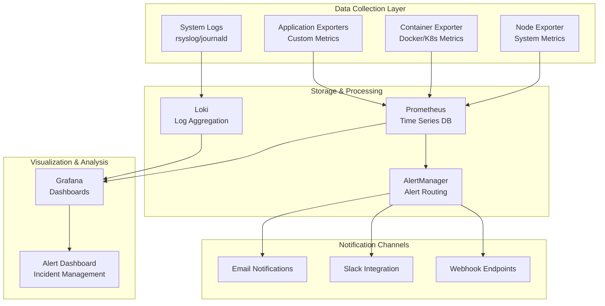

# Monitoring & Observability Stack

This directory contains the complete monitoring and observability infrastructure for the homelab environment, implementing enterprise-grade practices for metrics collection, visualization, and alerting.

## 🏗️ Architecture Overview



## 📊 Components

### Prometheus (Time Series Database)
- **Purpose:** Metrics collection and storage
- **Data Sources:** Node exporters, application metrics, custom exporters
- **Retention:** 30 days local, long-term in object storage
- **Scrape Interval:** 15 seconds for critical, 60 seconds for standard

### Grafana (Visualization Platform)
- **Purpose:** Dashboards, alerting, and data exploration
- **Data Sources:** Prometheus, Loki, InfluxDB
- **Authentication:** LDAP integration planned
- **Dashboards:** Infrastructure, application, security, and business metrics

### AlertManager (Alert Management)
- **Purpose:** Alert routing, grouping, and notification
- **Integrations:** Email, Slack, PagerDuty, webhooks
- **Features:** Alert silencing, inhibition rules, routing trees
- **High Availability:** Clustered configuration for reliability

### Loki (Log Aggregation)
- **Purpose:** Log collection, storage, and querying
- **Sources:** System logs, application logs, audit logs
- **Retention:** 7 days high-resolution, 90 days compressed
- **Query Language:** LogQL for efficient log searching

## 🚀 Quick Start

### Prerequisites
```bash
# Install dependencies
sudo apt update
sudo apt install -y docker.io docker-compose

# Add user to docker group
sudo usermod -aG docker $USER
newgrp docker
```

### Deploy Monitoring Stack
```bash
# Clone and navigate to monitoring directory
cd monitoring/

# Start the complete monitoring stack
docker-compose up -d

# Verify services are running
docker-compose ps

# View logs
docker-compose logs -f prometheus
```

### Access Interfaces
- **Grafana:** http://localhost:3000 (admin/admin)
- **Prometheus:** http://localhost:9090
- **AlertManager:** http://localhost:9093

## 📈 Dashboards

### Infrastructure Dashboards
1. **System Overview**
   - CPU, Memory, Disk usage across all nodes
   - Network traffic and error rates
   - Service availability and uptime

2. **Virtual Machine Performance**
   - VM resource utilization
   - Hypervisor performance metrics
   - Storage I/O patterns

3. **Network Monitoring**
   - VLAN traffic analysis
   - Firewall rule statistics
   - DNS query patterns and performance

### Security Dashboards
1. **Security Events**
   - Failed login attempts
   - Firewall blocks and allows
   - Certificate expiration tracking

2. **Compliance Monitoring**
   - CIS benchmark compliance
   - Security policy violations
   - Audit log analysis

### Application Dashboards
1. **Service Health**
   - Application response times
   - Error rates and status codes
   - Dependency health checks

2. **Resource Planning**
   - Capacity planning metrics
   - Growth trend analysis
   - Performance forecasting

## 🚨 Alerting Strategy

### Alert Severity Levels

| Severity | Response Time | Examples | Notification |
|----------|---------------|----------|--------------|
| Critical | Immediate | Service down, security breach | Phone, Slack, Email |
| High | 15 minutes | High resource usage, certificate expiring | Slack, Email |
| Medium | 1 hour | Performance degradation | Email |
| Low | 4 hours | Capacity warnings | Email (daily digest) |

### Alert Rules Categories

#### Infrastructure Alerts
```yaml
# High CPU usage
- alert: HighCPUUsage
  expr: cpu_usage_percent > 85
  for: 5m
  labels:
    severity: high
  annotations:
    summary: "High CPU usage detected"
    
# Low disk space
- alert: LowDiskSpace
  expr: disk_free_percent < 10
  for: 2m
  labels:
    severity: critical
```

#### Security Alerts
```yaml
# Multiple failed SSH attempts
- alert: SSHBruteForce
  expr: rate(ssh_failed_attempts[5m]) > 5
  for: 1m
  labels:
    severity: high
    
# Certificate expiration
- alert: CertificateExpiration
  expr: cert_days_until_expiry < 30
  for: 1h
  labels:
    severity: medium
```

## 🔧 Configuration

### Prometheus Configuration
```yaml
# /monitoring/prometheus/prometheus.yml
global:
  scrape_interval: 15s
  evaluation_interval: 15s

rule_files:
  - "alert_rules/*.yml"

scrape_configs:
  - job_name: 'node-exporter'
    static_configs:
      - targets: ['node-exporter:9100']
    scrape_interval: 15s
    
  - job_name: 'homelab-vms'
    static_configs:
      - targets: 
        - '192.168.100.10:9100'  # master node
        - '192.168.100.11:9100'  # worker1
        - '192.168.100.12:9100'  # worker2

alerting:
  alertmanagers:
    - static_configs:
        - targets: ['alertmanager:9093']
```

### Grafana Provisioning
```yaml
# /monitoring/grafana/provisioning/datasources/prometheus.yml
apiVersion: 1

datasources:
  - name: Prometheus
    type: prometheus
    url: http://prometheus:9090
    access: proxy
    isDefault: true
    
  - name: Loki
    type: loki
    url: http://loki:3100
    access: proxy
```

### AlertManager Configuration
```yaml
# /monitoring/alertmanager/alertmanager.yml
global:
  smtp_smarthost: 'localhost:587'
  smtp_from: 'alerts@homelab.local'

route:
  group_by: ['alertname', 'severity']
  group_wait: 30s
  group_interval: 5m
  repeat_interval: 12h
  receiver: 'web.hook'
  routes:
    - match:
        severity: critical
      receiver: 'critical-alerts'
    - match:
        severity: high
      receiver: 'high-alerts'

receivers:
  - name: 'web.hook'
    webhook_configs:
      - url: 'http://webhook:5000/alerts'
        
  - name: 'critical-alerts'
    email_configs:
      - to: 'admin@homelab.local'
        subject: 'CRITICAL: {{ .GroupLabels.alertname }}'
        body: |
          {{ range .Alerts }}
          Alert: {{ .Annotations.summary }}
          Description: {{ .Annotations.description }}
          {{ end }}
```

## 📊 Metrics Collection

### System Metrics
- **CPU:** Usage, load average, temperature
- **Memory:** Usage, swap, cache statistics
- **Disk:** Usage, I/O rates, error counts
- **Network:** Throughput, packet rates, error rates

### Application Metrics
- **Response Time:** Request duration percentiles
- **Throughput:** Requests per second
- **Error Rates:** 4xx/5xx response codes
- **Resource Usage:** Application-specific metrics

### Custom Metrics
```bash
# Example: Custom script for monitoring VM performance
#!/bin/bash
# vm-performance-exporter.sh

echo "# HELP vm_cpu_usage VM CPU usage percentage"
echo "# TYPE vm_cpu_usage gauge"
virsh list --all | grep running | while read line; do
    vm_name=$(echo $line | awk '{print $2}')
    cpu_usage=$(virsh cpu-stats $vm_name | grep "cpu_time" | awk '{print $2}')
    echo "vm_cpu_usage{vm=\"$vm_name\"} $cpu_usage"
done
```

## 🔍 Log Management

### Log Sources
1. **System Logs**
   - `/var/log/syslog` - System events
   - `/var/log/auth.log` - Authentication events
   - `/var/log/kern.log` - Kernel messages

2. **Application Logs**
   - Libvirt logs: `/var/log/libvirt/`
   - pfSense logs via syslog
   - Custom application logs

3. **Security Logs**
   - SSH access logs
   - Firewall logs
   - IDS/IPS alerts

### Log Processing Pipeline
```yaml
# Promtail configuration for log collection
server:
  http_listen_port: 9080
  grpc_listen_port: 0

positions:
  filename: /tmp/positions.yaml

clients:
  - url: http://loki:3100/loki/api/v1/push

scrape_configs:
  - job_name: system
    static_configs:
      - targets:
          - localhost
        labels:
          job: varlogs
          __path__: /var/log/*log
          
  - job_name: homelab
    static_configs:
      - targets:
          - localhost
        labels:
          job: homelab
          __path__: /var/log/libvirt/*.log
```

## 🎯 Performance Tuning

### Prometheus Optimization
```yaml
# Storage optimization
storage:
  tsdb:
    retention.time: 30d
    retention.size: 50GB
    wal-compression: true
    
# Query optimization
query:
  max-concurrent-queries: 20
  timeout: 2m
  max-samples: 50000000
```

### Grafana Performance
```ini
# grafana.ini optimizations
[database]
max_idle_conn = 2
max_open_conn = 0
conn_max_lifetime = 14400

[dashboards]
versions_to_keep = 20
min_refresh_interval = 5s

[alerting]
max_concurrent_renders = 10
evaluation_timeout_seconds = 30
```

## 🧪 Testing & Validation

### Health Check Scripts
```bash
#!/bin/bash
# monitoring-health-check.sh

echo "=== Monitoring Stack Health Check ==="

# Check Prometheus
if curl -s http://localhost:9090/-/healthy > /dev/null; then
    echo "✅ Prometheus: Healthy"
else
    echo "❌ Prometheus: Unhealthy"
fi

# Check Grafana
if curl -s http://localhost:3000/api/health > /dev/null; then
    echo "✅ Grafana: Healthy"
else
    echo "❌ Grafana: Unhealthy"
fi

# Check AlertManager
if curl -s http://localhost:9093/-/healthy > /dev/null; then
    echo "✅ AlertManager: Healthy"
else
    echo "❌ AlertManager: Unhealthy"
fi
```

### Load Testing
```bash
# Generate test metrics for validation
for i in {1..1000}; do
    curl -X POST http://localhost:9091/metrics/job/test_job/instance/test_instance \
         --data-binary "test_metric $RANDOM"
    sleep 1
done
```

## 📚 Enterprise Best Practices

### Security Considerations
- **Authentication:** LDAP/SAML integration
- **Authorization:** Role-based access control
- **Encryption:** TLS for all communications
- **Network Segmentation:** Monitoring VLAN isolation

### Scalability Planning
- **Horizontal Scaling:** Prometheus federation
- **Storage Optimization:** Remote storage backends
- **High Availability:** Multi-instance deployments
- **Load Balancing:** Service discovery integration

### Compliance & Governance
- **Data Retention:** Automated cleanup policies
- **Audit Logging:** Full access and change tracking
- **Backup Strategy:** Configuration and data backups
- **Documentation:** Runbooks and procedures

## 🔗 Integration Points

### CI/CD Integration
```yaml
# Example GitHub Actions integration
- name: Check Prometheus Rules
  run: promtool check rules alert_rules/*.yml
  
- name: Validate Grafana Dashboards
  run: grafana-cli admin validate-dashboards dashboards/
```

### Infrastructure as Code
```hcl
# Terraform example for monitoring resources
resource "docker_container" "prometheus" {
  name  = "prometheus"
  image = "prom/prometheus:latest"
  
  ports {
    internal = 9090
    external = 9090
  }
  
  volumes {
    host_path      = "/opt/monitoring/prometheus"
    container_path = "/etc/prometheus"
  }
}
```

## 📈 Roadmap

### Phase 1 (Current)
- ✅ Basic monitoring stack deployment
- ✅ System and application metrics
- ✅ Essential dashboards and alerts

### Phase 2 (Next Quarter)
- 📋 Advanced alerting with machine learning
- 📋 Distributed tracing with Jaeger
- 📋 Service mesh observability

### Phase 3 (Future)
- 🔮 Chaos engineering integration
- 🔮 Predictive analytics
- 🔮 Multi-cloud monitoring

---

*This monitoring stack demonstrates enterprise-grade observability practices, providing comprehensive visibility into infrastructure health, performance, and security posture.* 📊🚀 